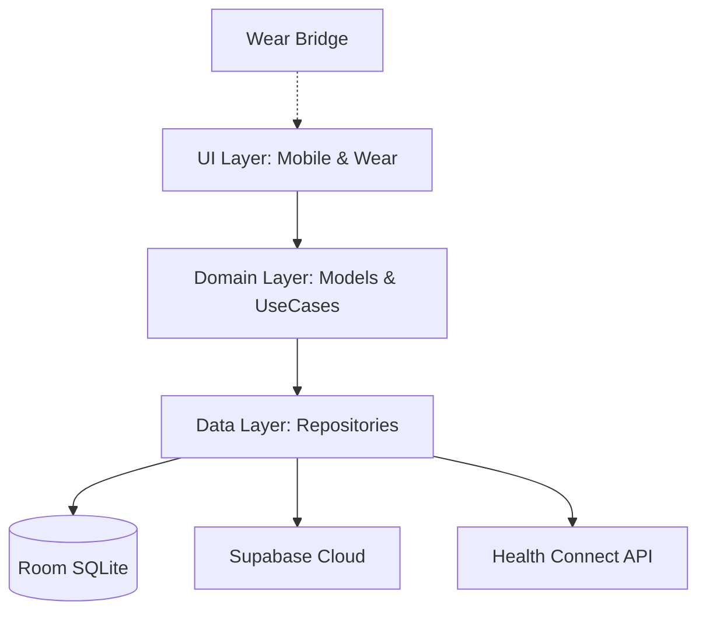

<div align="center">

# 🏋️ TrackMe: The Ultimate Fitness Ecosystem

**A pinnacle of modern Android engineering. Offline-first. AI-driven. Watch-synced.**

TrackMe isn't just a logger; it's a high-performance training partner designed for lifters who demand precision. Built with a dual-device strategy, it merges the power of a mobile command center with the seamless agility of Wear OS.

[](https://developer.android.com)
[](https://kotlinlang.org)
[](https://developer.android.com/jetpack/compose)
[](https://supabase.com)

</div>

---

## 🚀 The Dual-Device Edge

TrackMe redefines the workout experience by leveraging a sophisticated **Phone + Watch** ecosystem.

### 📱 Mobile Command Center
*   **Weekly Architect:** Build elite-level routines with a drag-and-drop Mon–Sun planner.
*   **Deep Analytics:** Move beyond simple logs with AI-driven strength forecasting and fatigue maps.
*   **Cloud Fortress:** Bi-directional Supabase sync with a last-write-wins merge strategy — your data is yours, everywhere.

### ⌚ Wear OS Companion (New!)
*   **Live Glance:** Track reps, sets, and rest timers directly from your wrist.
*   **Rotary Precision:** Use the digital crown to adjust weights and reps with surgical accuracy.
*   **Biometric Sync:** Real-time heart rate monitoring and calorie tracking during active sessions.
*   **Offline Resilience:** Log sets in the deepest basement gyms; the watch queues data and syncs as soon as the connection is restored.

---

## ✨ Intelligent Features

| Feature | Description |
|:---:|---|
| 🧠 | **Predictive Intelligence** \| AI-driven **1RM Projections** (14 to 365 days) and **Physique Growth** forecasting |
| 🌡️ | **Readiness Engine** \| Proprietary algorithm calculating recovery based on **HRV, RHR, and Sleep** data |
| 🗺️ | **Stimulus Heatmap** \| Visualizes muscle group fatigue vs. volume to prevent overtraining and plateauing |
| 🤸 | **Global Library** \| 800+ exercises with animated guides, instructions, and YouTube integrations |
| 💓 | **Health Connect** \| Deep integration with Samsung Health, Fitbit, and Google Fit via Android's Health Connect |
| ☁️ | **LWW Sync Strategy** \| Advanced **Last-Write-Wins** bidirectional sync ensures zero data loss across devices |
| 🔐 | **Enterprise Auth** \| Native Google Sign-In and Credential Manager integration for a frictionless setup |

---

## 📱 Screen Gallery

### Mobile Experience
*   **Home Dashboard:** 7-day interactive strip, today's targets, active-session banner, and real-time Health Connect snapshots.
*   **Weekly Planner:** High-fidelity Mon–Sun card interface for routine construction.
*   **Day Editor:** Precision exercise management with drag-to-reorder and target-set configuration.
*   **Progress Hub:** Vico-powered strength charts, activity heatmaps, and muscle volume analytics.
*   **Intelligence Tab:** Deep-dive into Readiness scores, 1RM projections, and Plateau alerts.

### Wear OS Experience
*   **Active Session:** Progress ring, exercise details, and real-time volume tracking on your wrist.
*   **Set Logger:** Optimized interface for logging weight/reps with rotary support and haptics.
*   **Rest Timer:** Dynamic countdown with skip/adjust functionality to keep your intensity high.
*   **Exercise Switcher:** Seamlessly browse and switch between planned exercises mid-session.

---

## 🛠️ Getting Started

To get the project running locally, follow these steps:

1.  **Environment Setup**: Copy `local.properties.example` to `local.properties` and fill in your Supabase credentials and API keys.
2.  **Backend Setup**: Run the contents of `run_sql_in_supabase.sql` in your Supabase SQL Editor to initialize the database schema and security policies.
3.  **Build**: Sync Gradle and build the project. Note that Kotlin 2.0.21 and the Compose Compiler plugin are required.

---

## 🏗️ Architecture: Engineered for Scale

TrackMe follows a robust **Clean Architecture** with a strict separation of concerns, optimized for multi-module communication.



### The Multi-Module Breakdown
*   **`:app`**: The flagship mobile experience.
*   **`:wear`**: High-performance Wear OS application built with Compose Material 3.
*   **`:wear-bridge`**: The communication backbone using the Wearable Data Layer API for ultra-low latency sync.

---

## 🛠️ Tech Stack

### Core & UI
*   **Kotlin 2.0.21:** Leveraging the latest K2 compiler and the new Compose Compiler plugin.
*   **Jetpack Compose (BOM 2024.10.00):** State-of-the-art declarative UI for both Mobile and Wear.
*   **Material 3:** Contemporary design language with a "Glass-morphism" aesthetic.
*   **Vico Charts:** High-performance data visualizations for complex fitness metrics.

### Data & Backend
*   **Room Persistence:** The local source of truth for offline-first reliability.
*   **Supabase Kotlin SDK (2.6.1):** Real-time Postgres backend with Row Level Security.
*   **Ktor & kotlinx.serialization:** Lightweight, multiplatform-ready networking and JSON handling.
*   **WorkManager:** Handles the background heavy lifting for complex sync jobs.

### Security & Hardware
*   **Credential Manager:** Modern, passkey-ready authentication.
*   **Health Services (Wear):** Direct sensor access for heart rate and exercise tracking.
*   **Security Crypto:** Encrypted local storage for sensitive tokens.

---

## 📂 Project Structure

```
├── app/                 # Mobile Application (Hilt, Compose, Vico)
├── wear/                # Wear OS Companion (Material 3 for Wear, Health Services)
├── wear-bridge/         # Shared Communication Protocol & Data Layer Logic
├── domain/              # Pure Kotlin business logic & Analytics Engine
├── data/                # Repository implementations & Sync Orchestration
└── sync/                # WorkManager Jobs (SyncWorker, HealthSyncWorker)
```

---

## 🎨 Design Philosophy

TrackMe utilizes a **Dark-First Material 3** theme designed for high-contrast visibility in gym environments.

*   **Primary:** `#A78BFA` (Violet) — Focus and Energy.
*   **Success:** `#34D399` (Teal) — Achievement and Completion.
*   **Critical:** `#F87171` (Coral) — Overtraining Alerts and Destructive Actions.
*   **Background:** `#111118` (Charcoal) — Battery-efficient OLED deep blacks.

---

## 🗺️ Roadmap: The Future of Training

- [x] **Wear OS Integration:** Real-time logging and sensor sync.
- [x] **Predictive Analytics:** 1RM forecasting and Readiness scores.
- [ ] **AI Training Coach:** Dynamic volume adjustments based on Readiness.
- [ ] **Muscle Fatigue Heatmap (3D):** Interactive 3D body map for recovery visualization.
- [ ] **Macro-Nutrient Sync:** Nutrition tracking integration with MyFitnessPal/LoseIt.
- [ ] **Social Circles:** Share PRs and compete in volume challenges.

---

## 📄 License

**MIT License — Copyright (c) 2026 Pranay Harjai**

*Crafted with precision for those who never settle. TrackMe is your journey, quantified.*
